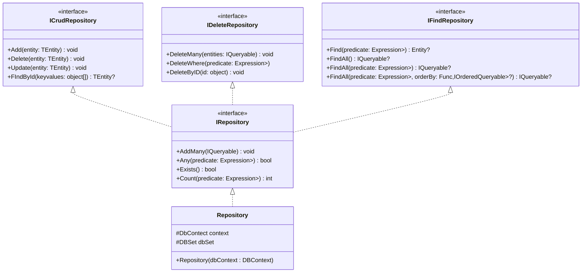

# HFA Tools

A library of generic resources commonly used in software development.

Features:

- Repository (Generic CRUD operations using DbContext, simplifying data access logic)
- Auth (Provides models for authentication and authorization of resource access)
- Unit of works (Implements the Unit of Work pattern to coordinate repository operations within a secure transactional boundary)

## Repository

A generic repository for common SQL operations using Entity Framework Core.

This repository provides support for:

- CRUD operations
- Custom deletes
- Querying entities with predicates
- Counting and existence checks

## Class Diagram (Repository)

## Auth

## Class Diagram (Auth)